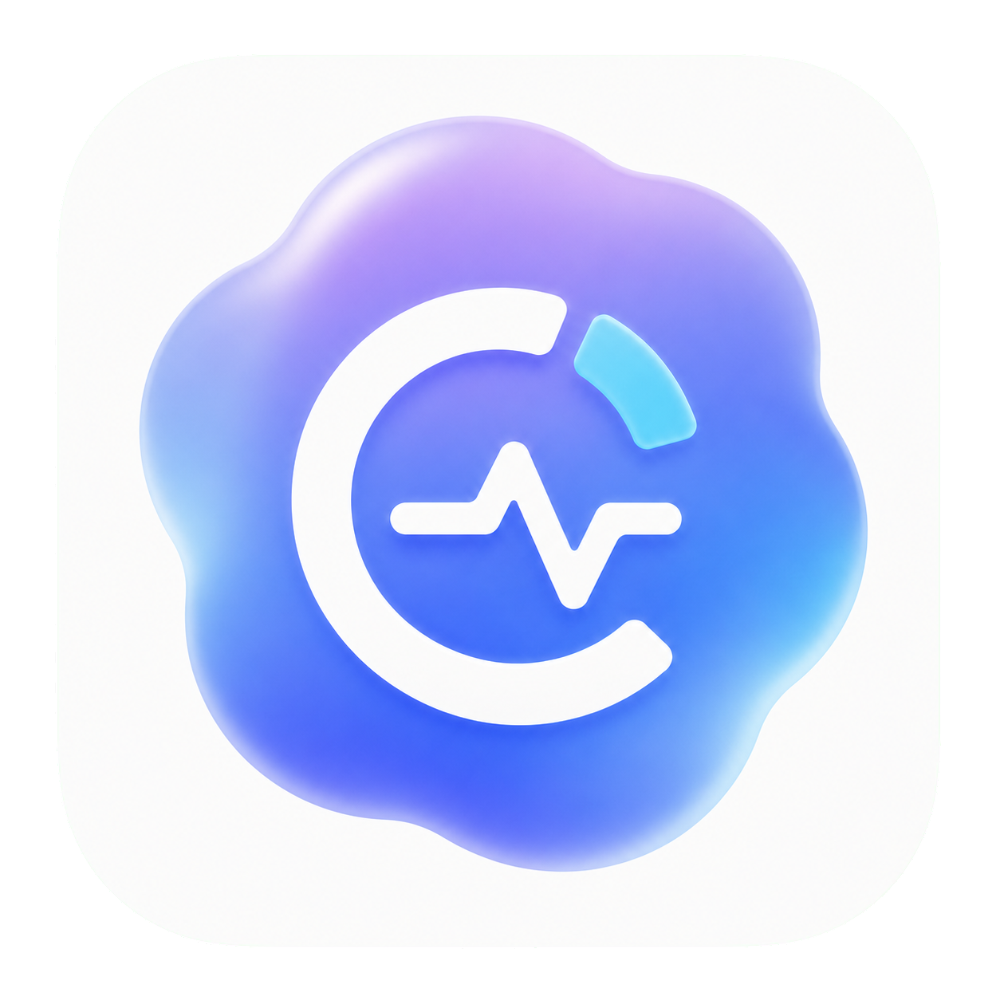
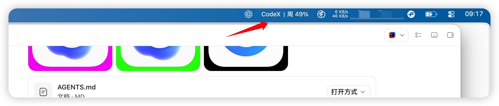

<p align="center">
  
</p>

<h1 align="center">Codex Pulse</h1>

<p align="center">一个轻量的 macOS 菜单栏 Codex 额度监控工具。</p>

> 非官方社区项目，与 OpenAI 无隶属关系，也未获得 OpenAI 的认可或背书。Codex 和 OpenAI 是其各自权利人的商标。



菜单栏常驻显示：

```text
CodeX｜周 68%
```

## 一句话交给 Codex 安装

把下面这一行发给 Codex：

```text
请安装这个工具：https://github.com/wanweiLab/codex-usage-menu
```

Codex 会先检查仓库和安装脚本，然后在本机编译、测试、安装并启动应用。默认安装位置是 `~/Applications/Codex Pulse.app`，不需要 `sudo`。

## 功能

- 菜单栏显示 `CodeX｜周 xx%` 格式的本周剩余额度
- 原生 Codex Pulse 应用图标和简洁的 macOS 菜单栏界面
- 展示周额度、短周期额度和重置时间
- 启动时读取一次账号套餐和脱敏邮箱
- 每 5 分钟自动刷新，支持手动刷新
- 复用一个长连接并串行刷新，断线后自动重连一次
- 刷新失败时保留上次额度，并提供不含凭证的诊断信息
- 自动适配 macOS 深色和浅色模式
- 不读取、不保存 Codex 登录令牌
- 完全从当前仓库源码在本机编译安装

## 工作原理

应用启动本机已有的：

```text
codex app-server --stdio
```

然后调用两个本地接口：

- `account/read`：启动时读取一次账号类型、套餐和邮箱
- `account/rateLimits/read`：读取额度，启动时、每 5 分钟或手动刷新时调用

两个接口复用同一个本地 App Server 长连接，请求会串行执行；连接中断或超时后会自动重建并重试一次。认证由 Codex 子进程使用现有登录完成。应用不会读取或保存 Token、API Key、浏览器 Cookie、钥匙串项目或 Codex 认证文件，也没有统计或遥测。详情见 [SECURITY.md](SECURITY.md)。

## 系统要求

- macOS 13 或更高版本
- Swift 5.10 或更高版本（Xcode Command Line Tools）
- 已安装并登录 ChatGPT、Codex app 或 Codex CLI

应用会依次检查 ChatGPT/Codex app、自定义 `CODEX_CLI_PATH`、`~/.local/bin`、Homebrew 和系统 `PATH` 中的 Codex。

## 手动安装

```bash
git clone https://github.com/wanweiLab/codex-usage-menu.git
cd codex-usage-menu
swift test
./scripts/install.sh
```

更新时拉取最新代码后再次执行 `./scripts/install.sh`。卸载运行：

```bash
./scripts/uninstall.sh
```

更多安装选项见 [INSTALL.md](INSTALL.md)。

## 本地开发

```bash
swift test
swift run
```

生成图标并构建 `.app`：

```bash
./scripts/generate-icon.sh
./scripts/build-app.sh
open "build/Codex Pulse.app"
```

仓库已经包含可直接构建的 `AppIcon.icns`；只有重新生成图标时才需要完整安装 Xcode（`actool`）。

真实账号集成测试默认关闭，需要时显式运行：

```bash
CODEX_USAGE_LIVE_TEST=1 swift test --filter testLiveClientReadsAccountThenRateLimits
```

## 常见问题

### 提示“没有找到 Codex”

先安装并登录 ChatGPT 或 Codex。若 Codex 在自定义位置，用绝对路径安装：

```bash
CODEX_CLI_PATH=/absolute/path/to/codex ./scripts/install.sh
```

### 菜单栏显示 `--` 或读取超时

确认 Codex 已登录，再点面板底部的刷新按钮。如果 Codex App Server 的接口在新版本中发生变化，请提交 issue，并注明 macOS 和 Codex 安装方式；不要粘贴凭证或完整邮箱。

### macOS 阻止打开应用

当前版本由用户本机从源码构建并进行 ad-hoc 签名，不是 Apple Developer ID 公证发行版。请确认源码来自本仓库，再在“系统设置 → 隐私与安全性”中允许打开。

## 参与贡献

欢迎提交 issue 和 pull request，开发说明见 [CONTRIBUTING.md](CONTRIBUTING.md)。项目采用 [MIT License](LICENSE)。
